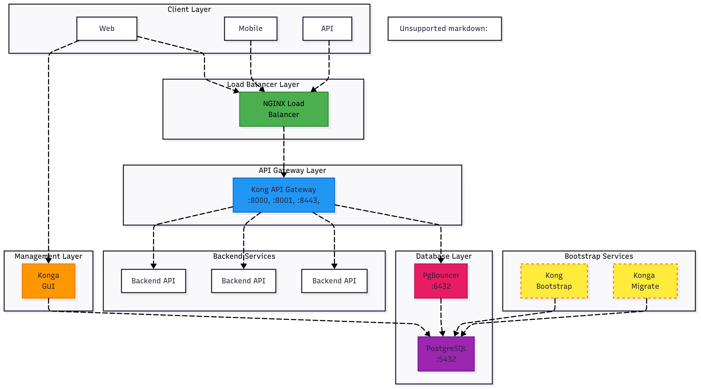
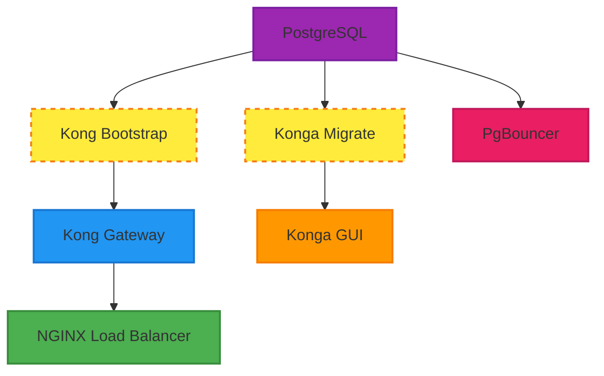

# Kong API Gateway dengan Konga GUI

Setup lengkap Kong API Gateway Community Edition dengan Konga sebagai web management interface menggunakan PostgreSQL sebagai database.

## Topologi Arsitektur

### Diagram Topologi
```mermaid



```
### ASCII Art Topologi

```
┌─────────────────────┐    ┌─────────────────────┐    ┌─────────────────────┐
│   Web Browser       │    │   Mobile App        │    │   API Client        │
│                     │    │                     │    │                     │
└──────────┬──────────┘    └──────────┬──────────┘    └──────────┬──────────┘
           │                          │                          │
           └──────────────┬───────────────────────┬──────────────┘
                          │                       │
                ┌─────────▼─────────┐             │
                │  NGINX Load       │             │
                │  Balancer         │             │
                │  :80, :8080       │             │
                └─────────┬─────────┘             │
                          │                       │
                ┌─────────▼─────────┐             │
                │  Kong API         │             │
                │  Gateway          │             │
                │  :8000,:8001      │             │
                │  :8443,:8444      │             │
                └─────────┬─────────┘             │
                          │                       │
              ┌───────────┼───────────┐           │
              │           │           │           │
    ┌─────────▼─┐  ┌─────────▼─┐  ┌─────────▼─┐   │
    │Backend    │  │Backend    │  │Backend    │   │
    │API 1      │  │API 2      │  │API N      │   │
    └───────────┘  └───────────┘  └───────────┘   │
                                                  │
                          ┌─────────────────────────▼─────────────────────┐
                          │             Management Layer                   │
                          │                                               │
                          │  ┌─────────────┐    ┌─────────────────────┐   │
                          │  │   Konga     │    │   Kong Admin API    │   │
                          │  │   GUI       │    │   (via NGINX)       │   │
                          │  │   :1337     │    │   :8080             │   │
                          │  └─────────────┘    └─────────────────────┘   │
                          └───────────────────┬─────────────────────────┘
                                              │
                          ┌───────────────────▼─────────────────────────┐
                          │             Database Layer                   │
                          │                                             │
                          │  ┌─────────────┐    ┌─────────────────────┐ │
                          │  │ PgBouncer   │    │    PostgreSQL      │ │
                          │  │ Connection  │───▶│    :5432            │ │
                          │  │ Pool :6432  │    │    ┌─────────────┐  │ │
                          │  └─────────────┘    │    │ Kong DB     │  │ │
                          │                     │    │ Konga DB    │  │ │
                          │                     │    └─────────────┘  │ │
                          │                     └─────────────────────┘ │
                          └─────────────────────────────────────────────┘

┌─────────────────────────────────────────────────────────────────────────────┐
│                        Bootstrap Services (Run Once)                        │
│                                                                             │
│  ┌─────────────────┐              ┌─────────────────────────────────────┐   │
│  │ Kong Bootstrap  │─ ─ ─ ─ ─ ─ ▶ │         PostgreSQL                  │   │
│  │ (Migration)     │              │         (Schema Setup)              │   │
│  └─────────────────┘              │                                     │   │
│                                   │  ┌─────────────────────────────────┐ │   │
│  ┌─────────────────┐              │  │ Konga Migrate                   │ │   │
│  │ Konga Migrate   │─ ─ ─ ─ ─ ─ ▶ │  │ (Konga Schema Setup)            │ │   │
│  │ (Preparation)   │              │  └─────────────────────────────────┘ │   │
│  └─────────────────┘              └─────────────────────────────────────┘   │
└─────────────────────────────────────────────────────────────────────────────┘
```

### Port Mapping

| Service | Internal Port | External Port | Description |
|---------|---------------|---------------|-------------|
| NGINX LB | 80 | 80 | Load balanced Kong Proxy |
| NGINX LB | 8001 | 8080 | Load balanced Kong Admin API |
| Kong Gateway | 8000 | 8000 | Kong Proxy HTTP |
| Kong Gateway | 8001 | 8001 | Kong Admin API HTTP |
| Kong Gateway | 8443 | 8443 | Kong Proxy HTTPS |
| Kong Gateway | 8444 | 8444 | Kong Admin API HTTPS |
| Konga GUI | 1337 | 1337 | Web Management Interface |
| PostgreSQL | 5432 | 5432 | Database Direct Access |
| PgBouncer | 5432 | 6432 | Connection Pool |

### Network Flow

1. **Client Requests** → NGINX Load Balancer (Port 80)
2. **Load Balancer** → Kong API Gateway (Port 8000)
3. **Kong Gateway** → Backend Services (Various Ports)
4. **Management Access** → Konga GUI (Port 1337)
5. **Database Access** → PgBouncer (Port 6432) → PostgreSQL (Port 5432)

## Struktur Project

### Struktur Awal (sebelum install)
```
kong-gateway-api/
├── docker-compose.yml  # Konfigurasi Docker Compose
├── init-db.sql        # Script inisialisasi database
├── install.sh         # Script instalasi otomatis (executable)
├── clean-logs.sh      # Script pembersihan log files (executable)
├── .env               # Environment variables (dibuat otomatis jika tidak ada)
├── .gitignore         # Git ignore file
└── README.md          # Dokumentasi ini
```

### Struktur Lengkap (setelah install)
```
kong-gateway-api/
├── docker-compose.yml
├── init-db.sql
├── install.sh*        # Executable script
├── clean-logs.sh*     # Log cleanup script
├── .env               # Environment configuration
├── .gitignore
├── README.md
├── nginx/             # NGINX Load Balancer configuration (auto-created)
│   └── kong.conf      # NGINX upstream and load balancing config
├── data/              # Data directory (auto-created)
│   └── postgres/      # PostgreSQL persistent data (mounted)
│       ├── base/
│       ├── global/
│       ├── pg_wal/
│       └── ...        # PostgreSQL internal files
└── logs/              # Logs directory (auto-created)
    ├── kong/          # Kong application logs (mounted)
    ├── konga/         # Konga application logs (mounted)
    ├── postgres/      # PostgreSQL logs (for future use)
    ├── pgbouncer/     # PgBouncer connection pooling logs (mounted)
    └── nginx/         # NGINX load balancer logs (mounted)
```

## Direktori yang Dibuat Otomatis

- `data/postgres/` - Data PostgreSQL (mount lokal, persistent storage)
- `logs/kong/` - Log files Kong API Gateway
- `logs/konga/` - Log files Konga GUI
- `logs/postgres/` - Log files PostgreSQL (reserved untuk konfigurasi custom)
- `logs/pgbouncer/` - Log files PgBouncer connection pooling
- `logs/nginx/` - Log files NGINX load balancer
- `nginx/` - NGINX configuration directory

## Services yang Tersedia

> **Timezone Configuration**: Semua services yang berjalan kontinyu menggunakan timezone `Asia/Jakarta` untuk konsistensi logging dan timestamp.

1. **PostgreSQL** (postgres:11)
   - Port: 5432
   - Database: `kong` dan `konga` (terpisah dalam satu instance)
   - Volume: Persistent storage untuk data
   - Timezone: Asia/Jakarta
   - Health check: pg_isready

2. **PgBouncer** (pgbouncer/pgbouncer:latest)
   - Port: 6432
   - Connection pooling untuk PostgreSQL
   - Mode: Transaction pooling (configurable)
   - Logs: `./logs/pgbouncer/`
   - Timezone: Asia/Jakarta

3. **Kong API Gateway** (kong:3.4)
   - Port 8000: Kong Proxy HTTP
   - Port 8001: Kong Admin API HTTP  
   - Port 8443: Kong Proxy HTTPS
   - Port 8444: Kong Admin API HTTPS
   - Logs: `./logs/kong/`
   - Performance: Auto worker processes, memory cache
   - Timezone: Asia/Jakarta
   - Health check: kong health

4. **Kong Bootstrap** (kong:3.4)
   - Service sekali jalan untuk migrasi database
   - Otomatis membuat skema database Kong
   - **Tidak menggunakan timezone** (run once only)

5. **Konga Migrate** (pantsel/konga:0.14.9)
   - Service sekali jalan untuk migrasi database Konga
   - Otomatis membuat skema database Konga
   - **Tidak menggunakan timezone** (run once only)

6. **Konga GUI** (pantsel/konga:0.14.9)
   - Port 1337: Web interface untuk management Kong
   - Database adapter: PostgreSQL
   - Logs: `./logs/konga/`
   - Timezone: Asia/Jakarta
   - Authentication: NO_AUTH mode (production ready)

7. **NGINX Load Balancer** (nginx:alpine)
   - Port 80: Load balanced Kong Proxy
   - Port 8080: Load balanced Kong Admin API
   - Health checks dan failover
   - Logs: `./logs/nginx/`
   - Timezone: Asia/Jakarta
   - Health check: nginx -t

## Konfigurasi Services

### Service Dependencies & Startup Order



1. **PostgreSQL** starts first dengan health check
2. **Kong Bootstrap** & **Konga Migrate** run migrations (parallel, run once)
3. **Kong Gateway** & **Konga GUI** start after successful migrations
4. **PgBouncer** starts setelah PostgreSQL ready
5. **NGINX Load Balancer** starts terakhir setelah Kong ready

### Timezone Configuration

| Service | Timezone | Alasan |
|---------|----------|---------|
| PostgreSQL | Asia/Jakarta | Database timestamps dan logging |
| PgBouncer | Asia/Jakarta | Connection pool logging |
| Kong Gateway | Asia/Jakarta | API access logs dan error logs |
| Konga GUI | Asia/Jakarta | Web interface logging |
| NGINX | Asia/Jakarta | Access logs dan error logs |
| Kong Bootstrap | *None* | Run once only, tidak perlu timezone |
| Konga Migrate | *None* | Run once only, tidak perlu timezone |

### Health Checks

| Service | Health Check | Interval | Timeout | Retries |
|---------|-------------|----------|---------|---------|
| PostgreSQL | `pg_isready -U postgres` | 30s | 10s | 3 |
| Kong Gateway | `kong health` | 10s | 10s | 3 |
| NGINX | `nginx -t` | 30s | 10s | 3 |

### Restart Policies

| Service | Restart Policy | Alasan |
|---------|---------------|---------|
| PostgreSQL | unless-stopped | Database perlu persistent |
| PgBouncer | unless-stopped | Connection pool perlu always running |
| Kong Gateway | unless-stopped | API Gateway core service |
| Konga GUI | unless-stopped | Management interface |
| NGINX | unless-stopped | Load balancer |
| Kong Bootstrap | no | Migration sekali jalan |
| Konga Migrate | no | Migration sekali jalan |

## Cara Penggunaan

### Metode 1: Menggunakan Script Install (Recommended)

```bash
# Clone atau copy files ke direktori project
cd kong-gateway-api

# Jalankan script instalasi otomatis
./install.sh
```

**Script install.sh options:**
```bash
./install.sh              # Install dan start semua services
./install.sh --no-start    # Setup direktori saja, tidak start services
./install.sh --stop        # Stop semua services
./install.sh --restart     # Restart semua services  
./install.sh --logs        # Lihat logs semua services
./install.sh --status      # Cek status services
./install.sh --clean       # Stop dan hapus semua data (HATI-HATI!)
./install.sh --help        # Bantuan
```

### Metode 2: Manual

### 1. Persiapan
```bash
# Clone atau copy files ke direktori project
cd kong-gateway-api

# Buat direktori yang diperlukan
mkdir -p data/postgres logs/{kong,konga,postgres}

# (Opsional) Edit file .env sesuai kebutuhan
nano .env
```

### 2. Menjalankan Services
```bash
# Start semua services
docker-compose up -d

# Check status
docker-compose ps

# Lihat logs
docker-compose logs -f
```

### 3. Verifikasi Installation

**Kong API Gateway:**
```bash
# Test Kong Admin API
curl http://localhost:8001/

# Test Kong Proxy
curl http://localhost:8000/
```

**Konga GUI:**
- Buka browser: http://localhost:1337
- Buat akun admin pertama kali
- Tambahkan koneksi ke Kong Admin API: http://kong:8001

### 4. Menghentikan Services
```bash
# Stop services
docker-compose down

# Stop dan hapus volumes (HATI-HATI: akan menghapus data)
docker-compose down -v
```

## Konfigurasi Environment Variables

File `.env` berisi konfigurasi yang dapat disesuaikan:

**Database Configuration:**
- `POSTGRES_USER`: Username database PostgreSQL (default: postgres)
- `POSTGRES_PASSWORD`: Password database PostgreSQL
- `NODE_ENV`: Environment untuk Konga (development/production)

**Kong Performance Tuning:**
- `KONG_NGINX_WORKER_PROCESSES`: Jumlah worker processes (default: auto)
- `KONG_NGINX_WORKER_CONNECTIONS`: Koneksi per worker (default: 1024)
- `KONG_MEM_CACHE_SIZE`: Memory cache size (default: 128m)
- `KONG_LOG_LEVEL`: Log level (default: notice)

**PgBouncer Connection Pooling:**
- `PGBOUNCER_POOL_MODE`: Pool mode - transaction/session (default: transaction)
- `PGBOUNCER_MAX_CLIENT_CONN`: Max client connections (default: 100)
- `PGBOUNCER_DEFAULT_POOL_SIZE`: Default pool size (default: 20)
- `PGBOUNCER_MIN_POOL_SIZE`: Minimum pool size (default: 5)

**Database Connection Options:**
- `KONG_USE_PGBOUNCER`: Use PgBouncer (postgres/pgbouncer, default: postgres)
- `KONG_PG_PORT`: Database port (default: 5432)

## Database

### PostgreSQL Setup
Menggunakan satu instance PostgreSQL dengan dua database terpisah:
- Database `kong`: Untuk Kong API Gateway
- Database `konga`: Untuk Konga GUI

### Connection Pooling
PgBouncer tersedia untuk optimasi koneksi database:
- **Default**: Kong → PostgreSQL (direct connection)
- **Optimized**: Kong → PgBouncer → PostgreSQL (pooled connection)

Untuk mengaktifkan PgBouncer, edit `.env`:
```bash
KONG_USE_PGBOUNCER=pgbouncer
```

### Database Monitoring
```bash
# Connect ke PostgreSQL
docker-compose exec postgres psql -U postgres -d kong

# Monitor active connections
SELECT * FROM pg_stat_activity WHERE state = 'active';

# Check PgBouncer stats
docker-compose exec pgbouncer psql -p 5432 -U postgres pgbouncer -c "SHOW STATS;"
```

## Network

Semua services terhubung dalam network `kong-network` untuk komunikasi internal.

### Arsitektur

```
[Client] -> [NGINX:80] -> [Kong:8000] -> [Backend APIs]
                ↓
[Admin] -> [NGINX:8080] -> [Kong:8001] (Admin API)

[Kong] -> [PgBouncer:6432] -> [PostgreSQL:5432]
[Konga] -> [PostgreSQL:5432] (direct connection)
```

**Traffic Flow:**
- **Production Traffic**: Client → NGINX LB → Kong Proxy → Backend
- **Admin Access**: Admin → NGINX LB → Kong Admin API
- **Database**: Kong → PgBouncer → PostgreSQL (pooled)
- **GUI Management**: Browser → Konga → PostgreSQL (direct)

## Log Management

### Membersihkan Log Files

Script `clean-logs.sh` tersedia untuk mengelola log files secara otomatis:

```bash
# Lihat bantuan dan opsi yang tersedia
./clean-logs.sh --help

# Lihat statistik log files
./clean-logs.sh --stats

# Lihat semua log files
./clean-logs.sh --list

# Dry run - lihat apa yang akan dihapus tanpa benar-benar menghapus
./clean-logs.sh --dry-run

# Bersihkan semua log (interaktif)
./clean-logs.sh

# Bersihkan log Kong saja tanpa konfirmasi
./clean-logs.sh --force kong

# Custom: simpan 20 file terbaru, hapus 3 file lama
./clean-logs.sh --keep 20 --batch 3
```

**Konfigurasi Default:**
- Menyimpan **14 file terbaru** per service
- Menghapus **5 file lama** dalam satu batch
- Mendukung log Kong, Konga, dan PostgreSQL

**Contoh Penggunaan Rutin:**
```bash
# Crontab untuk cleanup otomatis setiap minggu
# 0 2 * * 0 /path/to/kong-gateway-api/clean-logs.sh --force
```

## Troubleshooting

### File .env tidak lengkap atau hilang
```bash
# Script install.sh akan otomatis membuat atau melengkapi .env
./install.sh --no-start

# Atau buat manual dengan variable yang diperlukan:
# POSTGRES_USER, POSTGRES_PASSWORD, NODE_ENV
```

### Kong tidak bisa connect ke database
```bash
# Check PostgreSQL logs
docker-compose logs postgres

# Check Kong bootstrap logs
docker-compose logs kong-bootstrap
```

### Konga tidak bisa connect ke Kong
- Pastikan Kong sudah running: `docker-compose ps`
- Gunakan hostname `kong` bukan `localhost` di Konga connection
- URL Kong Admin API: `http://kong:8001`

### Reset database
```bash
# Stop services dan hapus data lokal
./install.sh --clean

# Atau manual:
docker-compose down
rm -rf data/ logs/
./install.sh
```

### Konfigurasi Manual Konga Database

> ⚠️ **PERINGATAN**: Proses ini akan menghapus semua data Konga yang ada. Pastikan untuk backup data penting sebelum melanjutkan.

#### 1. Konga Prepare Config File

Buat file `konga-prepare-config.json` untuk konfigurasi manual Konga:

```bash
# Buat file konfigurasi Konga
cat > konga-prepare-config.json << 'EOF'
{
  "connections": {
    "postgres": {
      "adapter": "postgresql",
      "host": "kong-postgres",
      "port": 5432,
      "user": "postgres",
      "password": "kong_password_2024",
      "database": "konga"
    }
  },
  "models": {
    "connection": "postgres",
    "migrate": "alter"
  }
}
EOF
```

> 📝 **Catatan**: 
> - Pastikan password sesuai dengan yang ada di file `.env` Anda
> - Jika menggunakan credentials berbeda, update file config di atas
> - Host `kong-postgres` sesuai dengan container name di docker-compose.yml

#### Alternatif: Generate config dari .env file

```bash
# Generate config otomatis dari .env file
source .env
cat > konga-prepare-config.json << EOF
{
  "connections": {
    "postgres": {
      "adapter": "postgresql",
      "host": "kong-postgres", 
      "port": 5432,
      "user": "${POSTGRES_USER}",
      "password": "${POSTGRES_PASSWORD}",
      "database": "konga"
    }
  },
  "models": {
    "connection": "postgres",
    "migrate": "alter"
  }
}
EOF

# Verify config file dibuat dengan benar
echo "Generated config:"
cat konga-prepare-config.json
```

> 💡 **Tips**: Method ini otomatis menggunakan credentials dari file `.env` Anda, jadi tidak perlu manual update password.

#### Konfigurasi Migration Mode

Parameter `migrate` dalam file config menentukan bagaimana Konga menangani database schema:

| Mode | Deskripsi | Kapan Digunakan |
|------|-----------|-----------------|
| **`alter`** | Membuat tabel baru jika belum ada, mengubah struktur tabel yang sudah ada | ✅ **First time setup**<br>✅ **Schema changes/updates**<br>✅ **Recovery dari corrupted tables** |
| **`safe`** | Tidak melakukan perubahan pada schema, gunakan tabel yang sudah ada | ✅ **Tabel sudah ada dan valid**<br>✅ **Production environment**<br>✅ **Tidak ingin risiko data loss** |
| **`drop`** | Hapus semua tabel dan buat ulang (**DANGER**) | ⚠️ **Complete reset only**<br>⚠️ **Development environment**<br>❌ **TIDAK untuk production** |

**Contoh konfigurasi untuk skenario berbeda:**

```bash
# Untuk setup baru atau recovery (RECOMMENDED)
"models": {
  "connection": "default",
  "migrate": "alter"
}

# Untuk environment yang sudah stable
"models": {
  "connection": "default", 
  "migrate": "safe"
}

# Untuk complete reset (HATI-HATI!)
"models": {
  "connection": "default",
  "migrate": "drop"
}
```

> ⚠️ **PERINGATAN**: 
> - Mode `alter` aman untuk most use cases
> - Mode `safe` gunakan jika yakin schema sudah benar
> - Mode `drop` akan **MENGHAPUS SEMUA DATA** - gunakan dengan sangat hati-hati!

#### Script Generator untuk Config dengan Mode Berbeda

```bash
# Function untuk generate config dengan mode tertentu
generate_konga_config() {
    local migrate_mode=${1:-alter}
    source .env
    
    cat > konga-prepare-config.json << EOF
{
  "connections": {
    "default": {
      "adapter": "sails-postgresql",
      "host": "kong-postgres",
      "port": 5432,
      "user": "${POSTGRES_USER}",
      "password": "${POSTGRES_PASSWORD}",
      "database": "konga",
      "poolSize": 10,
      "ssl": false
    }
  },
  "models": {
    "connection": "default",
    "migrate": "${migrate_mode}"
  }
}
EOF
    
    echo "Generated konga-prepare-config.json with migrate mode: ${migrate_mode}"
    echo "Config content:"
    cat konga-prepare-config.json
}

# Usage examples:
generate_konga_config "alter"    # Default - untuk setup baru/recovery
generate_konga_config "safe"     # Untuk environment stable
generate_konga_config "drop"     # Untuk complete reset (DANGER!)
```

#### Best Practices: Pemilihan Migration Mode

**🎯 Rekomendasi berdasarkan skenario:**

| Skenario | Migration Mode | Alasan |
|----------|----------------|---------|
| **First time install** | `alter` | Membuat tabel baru dengan aman |
| **Konga upgrade** | `alter` | Handle schema changes otomatis |
| **Production restart** | `safe` | Tidak mengubah data yang ada |
| **Development testing** | `drop` | Reset complete untuk testing |
| **Recovery dari error** | `alter` | Fix corrupted/missing tables |
| **Schema sudah perfect** | `safe` | Performa lebih cepat, no changes |

**🔄 Migration Flow Decision:**

```
┌─ Apakah first time setup? ─ YES → use "alter"
│
├─ Apakah tabel sudah ada dan benar? ─ YES → use "safe"  
│
├─ Apakah ada schema corruption? ─ YES → use "alter"
│
├─ Apakah perlu complete reset? ─ YES → use "drop" (CAREFUL!)
│
└─ Default fallback → use "alter"
```

**⚡ Quick Commands untuk Common Scenarios:**

```bash
# New installation
generate_konga_config "alter" && docker run --rm --network=kong-network \
  -v $(pwd)/konga-prepare-config.json:/app/config/local.json \
  -e "NODE_ENV=production" pantsel/konga:0.14.9 -c prepare

# Production restart (tabel sudah ada)
generate_konga_config "safe" && docker-compose restart konga

# Development reset
generate_konga_config "drop" && ./reset-konga.sh
```

#### 2. Backup Database Konga (Recommended)

```bash
# Backup database konga sebelum reset (opsional tapi direkomendasikan)
docker exec kong-postgres pg_dump -U postgres konga > konga_backup_$(date +%Y%m%d_%H%M%S).sql

# Backup bisa di-restore dengan:
# docker exec -i kong-postgres psql -U postgres konga < konga_backup_YYYYMMDD_HHMMSS.sql
```

#### 3. Mengosongkan Database Konga (Jika Diperlukan)

**Step 1: Connect ke PostgreSQL container**
```bash
# Connect ke database PostgreSQL
docker exec -it kong-postgres psql -U postgres -d konga
```

**Step 2: Drop semua tabel Konga**
```sql
-- List semua tabel Konga
\dt

-- Drop tabel utama Konga (hati-hati dengan urutan karena foreign keys)
DROP TABLE IF EXISTS konga_api_health_checks CASCADE;
DROP TABLE IF EXISTS konga_netdata CASCADE;
DROP TABLE IF EXISTS konga_users CASCADE;
DROP TABLE IF EXISTS konga_passports CASCADE;
DROP TABLE IF EXISTS konga_settings CASCADE;
DROP TABLE IF EXISTS konga_kong_nodes CASCADE;
DROP TABLE IF EXISTS konga_kong_services CASCADE;
DROP TABLE IF EXISTS konga_kong_routes CASCADE;
DROP TABLE IF EXISTS konga_kong_consumers CASCADE;
DROP TABLE IF EXISTS konga_kong_plugins CASCADE;
DROP TABLE IF EXISTS konga_kong_upstreams CASCADE;
DROP TABLE IF EXISTS konga_kong_targets CASCADE;
DROP TABLE IF EXISTS konga_kong_certificates CASCADE;
DROP TABLE IF EXISTS konga_kong_snis CASCADE;

-- Verify semua tabel sudah terhapus
\dt

-- Exit dari psql
\q
```

**Step 3: (Alternatif) Reset database konga secara complete**
```bash
# Stop services dulu
docker-compose down

# Connect dan drop/recreate database
docker exec -it kong-postgres psql -U postgres

# Di dalam psql:
DROP DATABASE IF EXISTS konga;
CREATE DATABASE konga;
GRANT ALL PRIVILEGES ON DATABASE konga TO postgres;
\q

# Restart services
docker-compose up -d
```

**Step 4: (Recommended) Reset Schema dengan CASCADE - One Command**
```bash
# Reset semua schema dalam database konga (lebih cepat dan aman)
docker exec -i kong-postgres psql -U postgres -d konga <<EOF
DROP SCHEMA public CASCADE;
CREATE SCHEMA public;
GRANT ALL ON SCHEMA public TO postgres;
GRANT ALL ON SCHEMA public TO public;
EOF
```

#### Verifikasi Database Kosong

Setelah mengosongkan database, verifikasi bahwa semua tabel sudah terhapus:

```bash
# Check apakah ada tabel yang tersisa
docker exec -it kong-postgres psql -U postgres -d konga -c "\dt"

# Check semua objek dalam database (termasuk views, sequences, dll)
docker exec -it kong-postgres psql -U postgres -d konga -c "\d"

# Check dengan query detail - harus return empty result
docker exec -it kong-postgres psql -U postgres -d konga -c \
"SELECT table_schema, table_name FROM information_schema.tables WHERE table_schema NOT IN ('information_schema', 'pg_catalog');"
```

**Output yang diharapkan:**
- `\dt` → "Did not find any relations."
- `\d` → "Did not find any relations."  
- `information_schema.tables` query → Empty result (0 rows)

Jika semua command di atas tidak menunjukkan tabel apapun, database sudah bersih dan siap untuk prepare.

#### 3. Eksekusi Manual Konga Prepare

**Method 1: Menggunakan docker run dengan config file**
```bash
# Pastikan konga-prepare-config.json sudah dibuat
# Jalankan prepare command secara manual
docker run --rm \
  --network=kong-network \
  -v $(pwd)/konga-prepare-config.json:/app/config/local.json \
  -e "NODE_ENV=production" \
  pantsel/konga:0.14.9 \
  -c prepare
```

**Method 2: Menggunakan service yang ada (Recommended)**
```bash
# Pastikan services PostgreSQL sudah running
docker-compose up -d postgres

# Jalankan konga migrate service
docker-compose run --rm konga-migrate

# Atau jika service konga-migrate tidak ada, gunakan konga service
docker-compose run --rm konga -c prepare
```

**Method 3: Menggunakan service konga existing**
```bash
# Stop konga service dulu jika sedang running
docker-compose stop konga

# Jalankan prepare command
docker-compose run --rm \
  -e "NODE_ENV=production" \
  konga \
  node ./bin/konga.js prepare
```

#### 4. Verifikasi Prepare Berhasil

```bash
# Check tabel Konga sudah dibuat
docker exec -it kong-postgres psql -U postgres -d konga -c "\dt"

# Check service status
docker-compose ps konga

# Check Konga logs tidak ada error
docker-compose logs konga | tail -20

# Check Konga web interface accessible
curl -I http://localhost:1337

# Check dari browser
# Buka http://localhost:1337 dan pastikan halaman login muncul
```

#### 5. Troubleshooting Konga Prepare

**Error: Database connection failed**
```bash
# Check PostgreSQL running dan accessible
docker-compose ps postgres
docker-compose logs postgres

# Check network connectivity
docker run --rm --network=kong-network alpine ping -c 3 kong-postgres
```

**Error: Tables already exist**
```bash
# Option 1: Gunakan migrate mode 'safe' jika tabel sudah benar
generate_konga_config "safe"

# Option 2: Gunakan migrate mode 'alter' untuk update schema
generate_konga_config "alter"

# Option 3: Kosongkan database terlebih dahulu (lihat Step 3 di atas)
# Option 4: Gunakan migrate mode 'drop' (HATI-HATI: akan hapus semua data!)
generate_konga_config "drop"
```

**Error: Schema mismatch atau corruption**
```bash
# Gunakan mode 'alter' untuk fix schema issues
generate_konga_config "alter"

# Atau complete reset dengan 'drop'
generate_konga_config "drop"
```

**Error: Migration failed**
```bash
# Check Konga version compatibility
docker run --rm pantsel/konga:0.14.9 node --version

# Check database connection first
docker exec kong-postgres psql -U postgres -d konga -c "SELECT version();"

# Try different migration mode
generate_konga_config "safe"  # Jika tabel sudah ada
```

**Error: Permission denied**
```bash
# Check file permission untuk config
chmod 644 konga-prepare-config.json

# Check directory mount permission
ls -la $(pwd)/konga-prepare-config.json
```

#### 6. Script Automation untuk Konga Reset

Untuk memudahkan proses reset Konga, buat script `reset-konga.sh`:

```bash
cat > reset-konga.sh << 'EOF'
#!/bin/bash

set -e

echo "🔄 Konga Database Reset Script"
echo "=============================="

# Colors
RED='\033[0;31m'
GREEN='\033[0;32m'
YELLOW='\033[1;33m'
NC='\033[0m'

# Check if config file exists
if [ ! -f "konga-prepare-config.json" ]; then
    echo -e "${YELLOW}Creating konga-prepare-config.json...${NC}"
    cat > konga-prepare-config.json << 'JSON'
{
  "connections": {
    "postgres": {
      "adapter": "postgresql", 
      "host": "kong-postgres",
      "port": 5432,
      "user": "postgres",
      "password": "kong_password_2024",
      "database": "konga"
    }
  },
  "models": {
    "connection": "postgres",
    "migrate": "alter"
  }
}
JSON
fi

# Backup current database
echo -e "${YELLOW}Creating backup...${NC}"
docker exec kong-postgres pg_dump -U postgres konga > konga_backup_$(date +%Y%m%d_%H%M%S).sql 2>/dev/null || echo "No existing data to backup"

# Stop konga service
echo -e "${YELLOW}Stopping Konga service...${NC}"
docker-compose stop konga

# Reset database tables
echo -e "${YELLOW}Resetting database tables...${NC}"
docker exec -i kong-postgres psql -U postgres -d konga << 'SQL'
DROP SCHEMA public CASCADE;
CREATE SCHEMA public;
GRANT ALL ON SCHEMA public TO postgres;
GRANT ALL ON SCHEMA public TO public;
SQL

# Run prepare command
echo -e "${YELLOW}Running Konga prepare...${NC}"
docker run --rm \
  --network=kong-network \
  -v $(pwd)/konga-prepare-config.json:/app/config/local.json \
  -e "NODE_ENV=production" \
  pantsel/konga:0.14.9 \
  -c prepare

# Start konga service
echo -e "${YELLOW}Starting Konga service...${NC}"
docker-compose start konga

# Wait and check
echo -e "${YELLOW}Waiting for Konga to be ready...${NC}"
sleep 10

if curl -sf http://localhost:1337 > /dev/null; then
    echo -e "${GREEN}✅ Konga reset completed successfully!${NC}"
    echo -e "${GREEN}🌐 Konga available at: http://localhost:1337${NC}"
else
    echo -e "${RED}❌ Konga might not be ready yet. Check logs:${NC}"
    echo "docker-compose logs konga"
fi
EOF

# Make script executable
chmod +x reset-konga.sh

# Usage
./reset-konga.sh
```

#### 7. Quick Commands Reference

```bash
# Quick reset Konga (menggunakan script di atas)
./reset-konga.sh

# Manual prepare (tanpa reset database)
docker run --rm \
  --network=kong-network \
  -v $(pwd)/konga-prepare-config.json:/app/config/local.json \
  -e "NODE_ENV=production" \
  pantsel/konga:0.14.9 \
  -c prepare

# Check Konga tables
docker exec kong-postgres psql -U postgres -d konga -c "\dt"

# View Konga logs
docker-compose logs -f konga

# Restart Konga only
docker-compose restart konga

# Quick database verification (should be empty after reset)
docker exec -it kong-postgres psql -U postgres -d konga -c "\dt"
docker exec -it kong-postgres psql -U postgres -d konga -c "\d"
docker exec -it kong-postgres psql -U postgres -d konga -c \
"SELECT table_schema, table_name FROM information_schema.tables WHERE table_schema NOT IN ('information_schema', 'pg_catalog');"
```

#### Database Reset - Complete Command Set

```bash
# One-liner untuk complete reset database konga
docker exec -i kong-postgres psql -U postgres -d konga <<EOF
DROP SCHEMA public CASCADE;
CREATE SCHEMA public;
GRANT ALL ON SCHEMA public TO postgres;
GRANT ALL ON SCHEMA public TO public;
EOF

# Verification commands untuk memastikan database kosong
echo "=== Checking tables ==="
docker exec -it kong-postgres psql -U postgres -d konga -c "\dt"

echo "=== Checking all database objects ==="
docker exec -it kong-postgres psql -U postgres -d konga -c "\d"

echo "=== Checking via information_schema ==="
docker exec -it kong-postgres psql -U postgres -d konga -c \
"SELECT table_schema, table_name FROM information_schema.tables WHERE table_schema NOT IN ('information_schema', 'pg_catalog');"

echo "=== Expected: All commands should show 'no relations' or empty results ==="
```

#### Verification Functions

```bash
# Function untuk check database kosong
check_konga_database_empty() {
    echo "🔍 Checking if Konga database is empty..."
    
    echo "--- Tables check ---"
    table_count=$(docker exec -t kong-postgres psql -U postgres -d konga -c "\dt" 2>/dev/null | grep -c "public" || echo "0")
    
    echo "--- Objects check ---"  
    object_count=$(docker exec -t kong-postgres psql -U postgres -d konga -c "\d" 2>/dev/null | grep -c "public" || echo "0")
    
    echo "--- Information schema check ---"
    schema_count=$(docker exec -t kong-postgres psql -U postgres -d konga -c \
    "SELECT COUNT(*) FROM information_schema.tables WHERE table_schema NOT IN ('information_schema', 'pg_catalog');" \
    -t | tr -d '[:space:]')
    
    if [ "$table_count" = "0" ] && [ "$object_count" = "0" ] && [ "$schema_count" = "0" ]; then
        echo "✅ Database is empty - ready for prepare"
        return 0
    else
        echo "❌ Database still contains objects:"
        echo "  Tables: $table_count, Objects: $object_count, Schema tables: $schema_count"
        return 1
    fi
}

# Function untuk check Konga ready setelah prepare
check_konga_ready() {
    echo "🔍 Checking if Konga is ready after prepare..."
    
    # Check tables created
    table_count=$(docker exec -t kong-postgres psql -U postgres -d konga -c "\dt" | grep -c "konga" || echo "0")
    
    # Check service status
    service_status=$(docker-compose ps konga --format "table {{.State}}" | tail -n +2 | tr -d '[:space:]')
    
    # Check web interface
    web_status=$(curl -s -o /dev/null -w "%{http_code}" http://localhost:1337 || echo "000")
    
    echo "  Konga tables: $table_count"
    echo "  Service status: $service_status" 
    echo "  Web interface: HTTP $web_status"
    
    if [ "$table_count" -gt "0" ] && [ "$service_status" = "running" ] && [ "$web_status" = "200" ]; then
        echo "✅ Konga is ready!"
        return 0
    else
        echo "❌ Konga not ready yet"
        return 1
    fi
}

# Usage:
# check_konga_database_empty  # Before reset
# check_konga_ready          # After prepare
```

#### 8. Kapan Menggunakan Manual Prepare?

**Gunakan manual prepare jika:**
- ✅ Konga service gagal start dengan error database
- ✅ Tabel Konga corrupt atau tidak konsisten
- ✅ Migration otomatis gagal
- ✅ Perlu reset Konga configuration
- ✅ Upgrade Konga versi yang membutuhkan schema changes

**Tidak perlu manual prepare jika:**
- ❌ First time install (gunakan `./install.sh`)
- ❌ Normal restart services
- ❌ Hanya ingin restart Kong Gateway

#### 9. Verification Checklist

Setelah manual prepare, pastikan:

```bash
# 1. Check PostgreSQL terhubung
docker exec kong-postgres psql -U postgres -c "\l" | grep konga

# 2. Check tabel Konga ada
docker exec kong-postgres psql -U postgres -d konga -c "\dt"

# 3. Check Konga service running
docker-compose ps konga

# 4. Check Konga logs tidak ada error
docker-compose logs konga | tail -20

# 5. Check Konga web interface accessible
curl -I http://localhost:1337

# 6. Check dari browser
# Buka http://localhost:1337 dan pastikan halaman login muncul
```

### Permissions issues dengan mounted directories
```bash
# Fix permissions untuk data dan logs
sudo chown -R $USER:$USER data/ logs/
chmod -R 755 data/ logs/
```

### Log files menghabiskan banyak disk space
```bash
# Lihat penggunaan disk oleh log files
./clean-logs.sh --stats

# Bersihkan log files lama
./clean-logs.sh --dry-run    # Preview dulu
./clean-logs.sh --force      # Bersihkan tanpa konfirmasi

# Custom cleanup - simpan hanya 7 file terbaru
./clean-logs.sh --keep 7 --batch 10 --force
```

## Keamanan untuk Production

Untuk production environment, pertimbangkan:

1. Ganti password default di `.env`
2. Gunakan SSL/TLS certificates
3. Restrict access ke admin ports (8001, 8444)
4. Setup proper firewall rules
5. Regular backup database PostgreSQL

## Scaling Kong

### Load Balancer
- Gunakan load balancer seperti **NGINX** atau **AWS ALB** untuk mendistribusikan traffic ke beberapa instance Kong.
- Pastikan load balancer mendukung health check untuk memastikan hanya instance yang sehat menerima traffic.

### Worker Processes
- Tambahkan lebih banyak worker di Kong dengan mengatur environment variable `KONG_NGINX_WORKER_PROCESSES`.
- Contoh konfigurasi di `.env`:
  ```
  KONG_NGINX_WORKER_PROCESSES=4
  ```
- Sesuaikan jumlah worker dengan jumlah core CPU pada server.

---

## Optimasi Database

### Connection Pooling
- Gunakan PostgreSQL connection pooling seperti **PgBouncer** untuk mengurangi overhead koneksi.
- Konfigurasi PgBouncer untuk mendukung mode `transaction` atau `session` sesuai kebutuhan aplikasi.

### Monitoring Database
- Gunakan tools seperti `pg_stat_activity` untuk memonitor performa database.
- Contoh query untuk melihat aktivitas:
  ```sql
  SELECT * FROM pg_stat_activity WHERE state = 'active';
  ```
- Integrasikan monitoring dengan tools seperti **Prometheus** atau **Grafana** untuk visualisasi.

---

## Dokumentasi dan Proses

### Dokumentasi Internal
- Dokumentasikan semua konfigurasi dan proses deployment.
- Simpan dokumentasi di tempat yang mudah diakses oleh tim, seperti **Confluence**, **Notion**, atau **GitHub Wiki**.

### Incident Response Plan
- Siapkan rencana untuk menangani downtime atau insiden keamanan.
- Simulasikan recovery dari backup secara berkala untuk memastikan proses berjalan lancar.

### Regular Updates
- Pastikan Kong, Konga, dan PostgreSQL selalu menggunakan versi terbaru.
- Periksa changelog untuk mengetahui fitur baru atau perbaikan keamanan.
- Gunakan tools seperti **Dependabot** atau **Renovate** untuk memantau pembaruan dependencies.

---

## Summary: Kong API Gateway Stack

### Architecture Overview

Kong API Gateway Stack ini menyediakan solusi lengkap enterprise-grade dengan:

- **High Availability**: Load balancing dengan NGINX + health checks
- **Performance**: Connection pooling dengan PgBouncer
- **Management**: Web-based GUI dengan Konga
- **Monitoring**: Comprehensive logging untuk semua services
- **Timezone**: Konsistensi waktu dengan Asia/Jakarta
- **Scalability**: Configurable worker processes dan connection limits

### Key Benefits

✅ **Production Ready**: Health checks, restart policies, dan error handling  
✅ **Easy Management**: Web GUI untuk konfigurasi Kong  
✅ **Performance Optimized**: Connection pooling dan worker optimization  
✅ **Monitoring Ready**: Structured logs untuk semua components  
✅ **Timezone Consistent**: Asia/Jakarta untuk semua persistent services  
✅ **Database Optimized**: Separate databases dengan connection pooling  
✅ **Load Balanced**: NGINX front-end untuk high availability  

### Quick Start Summary

```bash
# Clone repository
git clone <repo-url> kong-gateway-api
cd kong-gateway-api

# One command setup
./install.sh

# Access services
# Kong Proxy: http://localhost:80
# Kong Admin: http://localhost:8080  
# Konga GUI: http://localhost:1337
```

### Service Port Reference

| Service | Port | Purpose | Access |
|---------|------|---------|---------|
| **NGINX** | 80 | Load Balanced Kong Proxy | Public |
| **NGINX** | 8080 | Load Balanced Kong Admin | Internal |
| **Kong** | 8000 | Direct Kong Proxy | Internal |
| **Kong** | 8001 | Direct Kong Admin API | Internal |
| **Konga** | 1337 | Web Management UI | Internal |
| **PostgreSQL** | 5432 | Database Direct | Internal |
| **PgBouncer** | 6432 | Connection Pool | Internal |

### Container Status Quick Check

```bash
# Check all services
docker compose ps

# Check logs
docker compose logs -f [service-name]

# Quick status
./install.sh --status
```