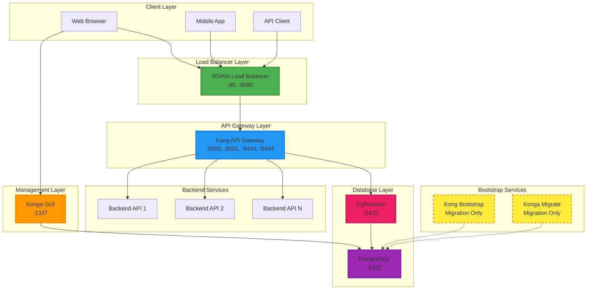
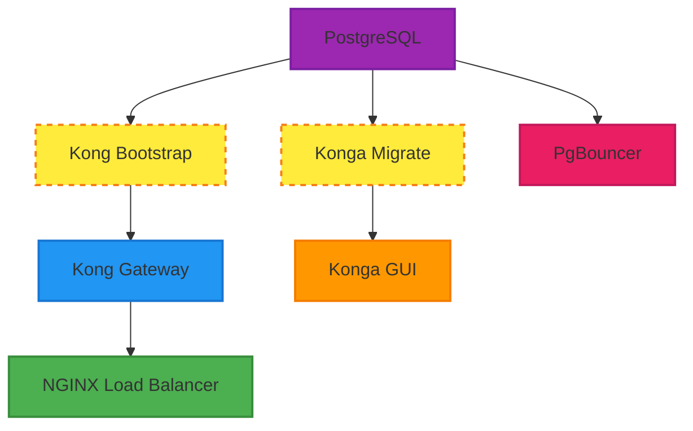

# Kong API Gateway dengan Konga GUI

Setup lengkap Kong API Gateway Community Edition dengan Konga sebagai web management interface menggunakan PostgreSQL sebagai database.

## Topologi Arsitektur

### Diagram Topologi



### ASCII Art Topologi

```
┌─────────────────────┐    ┌─────────────────────┐    ┌─────────────────────┐
│   Web Browser       │    │   Mobile App        │    │   API Client        │
│                     │    │                     │    │                     │
└──────────┬──────────┘    └──────────┬──────────┘    └──────────┬──────────┘
           │                          │                          │
           └──────────────┬───────────────────────┬──────────────┘
                          │                       │
                ┌─────────▼─────────┐             │
                │  NGINX Load       │             │
                │  Balancer         │             │
                │  :80, :8080       │             │
                └─────────┬─────────┘             │
                          │                       │
                ┌─────────▼─────────┐             │
                │  Kong API         │             │
                │  Gateway          │             │
                │  :8000,:8001      │             │
                │  :8443,:8444      │             │
                └─────────┬─────────┘             │
                          │                       │
              ┌───────────┼───────────┐           │
              │           │           │           │
    ┌─────────▼─┐  ┌─────────▼─┐  ┌─────────▼─┐   │
    │Backend    │  │Backend    │  │Backend    │   │
    │API 1      │  │API 2      │  │API N      │   │
    └───────────┘  └───────────┘  └───────────┘   │
                                                  │
                          ┌─────────────────────────▼─────────────────────┐
                          │             Management Layer                   │
                          │                                               │
                          │  ┌─────────────┐    ┌─────────────────────┐   │
                          │  │   Konga     │    │   Kong Admin API    │   │
                          │  │   GUI       │    │   (via NGINX)       │   │
                          │  │   :1337     │    │   :8080             │   │
                          │  └─────────────┘    └─────────────────────┘   │
                          └───────────────────┬─────────────────────────┘
                                              │
                          ┌───────────────────▼─────────────────────────┐
                          │             Database Layer                   │
                          │                                             │
                          │  ┌─────────────┐    ┌─────────────────────┐ │
                          │  │ PgBouncer   │    │    PostgreSQL      │ │
                          │  │ Connection  │───▶│    :5432            │ │
                          │  │ Pool :6432  │    │    ┌─────────────┐  │ │
                          │  └─────────────┘    │    │ Kong DB     │  │ │
                          │                     │    │ Konga DB    │  │ │
                          │                     │    └─────────────┘  │ │
                          │                     └─────────────────────┘ │
                          └─────────────────────────────────────────────┘

┌─────────────────────────────────────────────────────────────────────────────┐
│                        Bootstrap Services (Run Once)                        │
│                                                                             │
│  ┌─────────────────┐              ┌─────────────────────────────────────┐   │
│  │ Kong Bootstrap  │─ ─ ─ ─ ─ ─ ▶ │         PostgreSQL                  │   │
│  │ (Migration)     │              │         (Schema Setup)              │   │
│  └─────────────────┘              │                                     │   │
│                                   │  ┌─────────────────────────────────┐ │   │
│  ┌─────────────────┐              │  │ Konga Migrate                   │ │   │
│  │ Konga Migrate   │─ ─ ─ ─ ─ ─ ▶ │  │ (Konga Schema Setup)            │ │   │
│  │ (Preparation)   │              │  └─────────────────────────────────┘ │   │
│  └─────────────────┘              └─────────────────────────────────────┘   │
└─────────────────────────────────────────────────────────────────────────────┘
```

### Port Mapping

| Service | Internal Port | External Port | Description |
|---------|---------------|---------------|-------------|
| NGINX LB | 80 | 80 | Load balanced Kong Proxy |
| NGINX LB | 8001 | 8080 | Load balanced Kong Admin API |
| Kong Gateway | 8000 | 8000 | Kong Proxy HTTP |
| Kong Gateway | 8001 | 8001 | Kong Admin API HTTP |
| Kong Gateway | 8443 | 8443 | Kong Proxy HTTPS |
| Kong Gateway | 8444 | 8444 | Kong Admin API HTTPS |
| Konga GUI | 1337 | 1337 | Web Management Interface |
| PostgreSQL | 5432 | 5432 | Database Direct Access |
| PgBouncer | 5432 | 6432 | Connection Pool |

### Network Flow

1. **Client Requests** → NGINX Load Balancer (Port 80)
2. **Load Balancer** → Kong API Gateway (Port 8000)
3. **Kong Gateway** → Backend Services (Various Ports)
4. **Management Access** → Konga GUI (Port 1337)
5. **Database Access** → PgBouncer (Port 6432) → PostgreSQL (Port 5432)

## Struktur Project

### Struktur Awal (sebelum install)
```
kong-gateway-api/
├── docker-compose.yml  # Konfigurasi Docker Compose
├── init-db.sql        # Script inisialisasi database
├── install.sh         # Script instalasi otomatis (executable)
├── clean-logs.sh      # Script pembersihan log files (executable)
├── .env               # Environment variables (dibuat otomatis jika tidak ada)
├── .gitignore         # Git ignore file
└── README.md          # Dokumentasi ini
```

### Struktur Lengkap (setelah install)
```
kong-gateway-api/
├── docker-compose.yml
├── init-db.sql
├── install.sh*        # Executable script
├── clean-logs.sh*     # Log cleanup script
├── .env               # Environment configuration
├── .gitignore
├── README.md
├── nginx/             # NGINX Load Balancer configuration (auto-created)
│   └── kong.conf      # NGINX upstream and load balancing config
├── data/              # Data directory (auto-created)
│   └── postgres/      # PostgreSQL persistent data (mounted)
│       ├── base/
│       ├── global/
│       ├── pg_wal/
│       └── ...        # PostgreSQL internal files
└── logs/              # Logs directory (auto-created)
    ├── kong/          # Kong application logs (mounted)
    ├── konga/         # Konga application logs (mounted)
    ├── postgres/      # PostgreSQL logs (for future use)
    ├── pgbouncer/     # PgBouncer connection pooling logs (mounted)
    └── nginx/         # NGINX load balancer logs (mounted)
```

## Direktori yang Dibuat Otomatis

- `data/postgres/` - Data PostgreSQL (mount lokal, persistent storage)
- `logs/kong/` - Log files Kong API Gateway
- `logs/konga/` - Log files Konga GUI
- `logs/postgres/` - Log files PostgreSQL (reserved untuk konfigurasi custom)
- `logs/pgbouncer/` - Log files PgBouncer connection pooling
- `logs/nginx/` - Log files NGINX load balancer
- `nginx/` - NGINX configuration directory

## Services yang Tersedia

> **Timezone Configuration**: Semua services yang berjalan kontinyu menggunakan timezone `Asia/Jakarta` untuk konsistensi logging dan timestamp.

1. **PostgreSQL** (postgres:11)
   - Port: 5432
   - Database: `kong` dan `konga` (terpisah dalam satu instance)
   - Volume: Persistent storage untuk data
   - Timezone: Asia/Jakarta
   - Health check: pg_isready

2. **PgBouncer** (pgbouncer/pgbouncer:latest)
   - Port: 6432
   - Connection pooling untuk PostgreSQL
   - Mode: Transaction pooling (configurable)
   - Logs: `./logs/pgbouncer/`
   - Timezone: Asia/Jakarta

3. **Kong API Gateway** (kong:3.4)
   - Port 8000: Kong Proxy HTTP
   - Port 8001: Kong Admin API HTTP  
   - Port 8443: Kong Proxy HTTPS
   - Port 8444: Kong Admin API HTTPS
   - Logs: `./logs/kong/`
   - Performance: Auto worker processes, memory cache
   - Timezone: Asia/Jakarta
   - Health check: kong health

4. **Kong Bootstrap** (kong:3.4)
   - Service sekali jalan untuk migrasi database
   - Otomatis membuat skema database Kong
   - **Tidak menggunakan timezone** (run once only)

5. **Konga Migrate** (pantsel/konga:0.14.9)
   - Service sekali jalan untuk migrasi database Konga
   - Otomatis membuat skema database Konga
   - **Tidak menggunakan timezone** (run once only)

6. **Konga GUI** (pantsel/konga:0.14.9)
   - Port 1337: Web interface untuk management Kong
   - Database adapter: PostgreSQL
   - Logs: `./logs/konga/`
   - Timezone: Asia/Jakarta
   - Authentication: NO_AUTH mode (production ready)

7. **NGINX Load Balancer** (nginx:alpine)
   - Port 80: Load balanced Kong Proxy
   - Port 8080: Load balanced Kong Admin API
   - Health checks dan failover
   - Logs: `./logs/nginx/`
   - Timezone: Asia/Jakarta
   - Health check: nginx -t

## Konfigurasi Services

### Service Dependencies & Startup Order



1. **PostgreSQL** starts first dengan health check
2. **Kong Bootstrap** & **Konga Migrate** run migrations (parallel, run once)
3. **Kong Gateway** & **Konga GUI** start after successful migrations
4. **PgBouncer** starts setelah PostgreSQL ready
5. **NGINX Load Balancer** starts terakhir setelah Kong ready

### Timezone Configuration

| Service | Timezone | Alasan |
|---------|----------|---------|
| PostgreSQL | Asia/Jakarta | Database timestamps dan logging |
| PgBouncer | Asia/Jakarta | Connection pool logging |
| Kong Gateway | Asia/Jakarta | API access logs dan error logs |
| Konga GUI | Asia/Jakarta | Web interface logging |
| NGINX | Asia/Jakarta | Access logs dan error logs |
| Kong Bootstrap | *None* | Run once only, tidak perlu timezone |
| Konga Migrate | *None* | Run once only, tidak perlu timezone |

### Health Checks

| Service | Health Check | Interval | Timeout | Retries |
|---------|-------------|----------|---------|---------|
| PostgreSQL | `pg_isready -U postgres` | 30s | 10s | 3 |
| Kong Gateway | `kong health` | 10s | 10s | 3 |
| NGINX | `nginx -t` | 30s | 10s | 3 |

### Restart Policies

| Service | Restart Policy | Alasan |
|---------|---------------|---------|
| PostgreSQL | unless-stopped | Database perlu persistent |
| PgBouncer | unless-stopped | Connection pool perlu always running |
| Kong Gateway | unless-stopped | API Gateway core service |
| Konga GUI | unless-stopped | Management interface |
| NGINX | unless-stopped | Load balancer |
| Kong Bootstrap | no | Migration sekali jalan |
| Konga Migrate | no | Migration sekali jalan |

## Cara Penggunaan

### Metode 1: Menggunakan Script Install (Recommended)

```bash
# Clone atau copy files ke direktori project
cd kong-gateway-api

# Jalankan script instalasi otomatis
./install.sh
```

**Script install.sh options:**
```bash
./install.sh              # Install dan start semua services
./install.sh --no-start    # Setup direktori saja, tidak start services
./install.sh --stop        # Stop semua services
./install.sh --restart     # Restart semua services  
./install.sh --logs        # Lihat logs semua services
./install.sh --status      # Cek status services
./install.sh --clean       # Stop dan hapus semua data (HATI-HATI!)
./install.sh --help        # Bantuan
```

### Metode 2: Manual

### 1. Persiapan
```bash
# Clone atau copy files ke direktori project
cd kong-gateway-api

# Buat direktori yang diperlukan
mkdir -p data/postgres logs/{kong,konga,postgres}

# (Opsional) Edit file .env sesuai kebutuhan
nano .env
```

### 2. Menjalankan Services
```bash
# Start semua services
docker-compose up -d

# Check status
docker-compose ps

# Lihat logs
docker-compose logs -f
```

### 3. Verifikasi Installation

**Kong API Gateway:**
```bash
# Test Kong Admin API
curl http://localhost:8001/

# Test Kong Proxy
curl http://localhost:8000/
```

**Konga GUI:**
- Buka browser: http://localhost:1337
- Buat akun admin pertama kali
- Tambahkan koneksi ke Kong Admin API: http://kong:8001

### 4. Menghentikan Services
```bash
# Stop services
docker-compose down

# Stop dan hapus volumes (HATI-HATI: akan menghapus data)
docker-compose down -v
```

## Konfigurasi Environment Variables

File `.env` berisi konfigurasi yang dapat disesuaikan:

**Database Configuration:**
- `POSTGRES_USER`: Username database PostgreSQL (default: postgres)
- `POSTGRES_PASSWORD`: Password database PostgreSQL
- `KONGA_ENV`: Environment Konga (development/production)

**Kong Performance Tuning:**
- `KONG_NGINX_WORKER_PROCESSES`: Jumlah worker processes (default: auto)
- `KONG_NGINX_WORKER_CONNECTIONS`: Koneksi per worker (default: 1024)
- `KONG_MEM_CACHE_SIZE`: Memory cache size (default: 128m)
- `KONG_LOG_LEVEL`: Log level (default: notice)

**PgBouncer Connection Pooling:**
- `PGBOUNCER_POOL_MODE`: Pool mode - transaction/session (default: transaction)
- `PGBOUNCER_MAX_CLIENT_CONN`: Max client connections (default: 100)
- `PGBOUNCER_DEFAULT_POOL_SIZE`: Default pool size (default: 20)
- `PGBOUNCER_MIN_POOL_SIZE`: Minimum pool size (default: 5)

**Database Connection Options:**
- `KONG_USE_PGBOUNCER`: Use PgBouncer (postgres/pgbouncer, default: postgres)
- `KONG_PG_PORT`: Database port (default: 5432)

## Database

### PostgreSQL Setup
Menggunakan satu instance PostgreSQL dengan dua database terpisah:
- Database `kong`: Untuk Kong API Gateway
- Database `konga`: Untuk Konga GUI

### Connection Pooling
PgBouncer tersedia untuk optimasi koneksi database:
- **Default**: Kong → PostgreSQL (direct connection)
- **Optimized**: Kong → PgBouncer → PostgreSQL (pooled connection)

Untuk mengaktifkan PgBouncer, edit `.env`:
```bash
KONG_USE_PGBOUNCER=pgbouncer
```

### Database Monitoring
```bash
# Connect ke PostgreSQL
docker-compose exec postgres psql -U postgres -d kong

# Monitor active connections
SELECT * FROM pg_stat_activity WHERE state = 'active';

# Check PgBouncer stats
docker-compose exec pgbouncer psql -p 5432 -U postgres pgbouncer -c "SHOW STATS;"
```

## Network

Semua services terhubung dalam network `kong-network` untuk komunikasi internal.

### Arsitektur

```
[Client] -> [NGINX:80] -> [Kong:8000] -> [Backend APIs]
                ↓
[Admin] -> [NGINX:8080] -> [Kong:8001] (Admin API)

[Kong] -> [PgBouncer:6432] -> [PostgreSQL:5432]
[Konga] -> [PostgreSQL:5432] (direct connection)
```

**Traffic Flow:**
- **Production Traffic**: Client → NGINX LB → Kong Proxy → Backend
- **Admin Access**: Admin → NGINX LB → Kong Admin API
- **Database**: Kong → PgBouncer → PostgreSQL (pooled)
- **GUI Management**: Browser → Konga → PostgreSQL (direct)

## Log Management

### Membersihkan Log Files

Script `clean-logs.sh` tersedia untuk mengelola log files secara otomatis:

```bash
# Lihat bantuan dan opsi yang tersedia
./clean-logs.sh --help

# Lihat statistik log files
./clean-logs.sh --stats

# Lihat semua log files
./clean-logs.sh --list

# Dry run - lihat apa yang akan dihapus tanpa benar-benar menghapus
./clean-logs.sh --dry-run

# Bersihkan semua log (interaktif)
./clean-logs.sh

# Bersihkan log Kong saja tanpa konfirmasi
./clean-logs.sh --force kong

# Custom: simpan 20 file terbaru, hapus 3 file lama
./clean-logs.sh --keep 20 --batch 3
```

**Konfigurasi Default:**
- Menyimpan **14 file terbaru** per service
- Menghapus **5 file lama** dalam satu batch
- Mendukung log Kong, Konga, dan PostgreSQL

**Contoh Penggunaan Rutin:**
```bash
# Crontab untuk cleanup otomatis setiap minggu
# 0 2 * * 0 /path/to/kong-gateway-api/clean-logs.sh --force
```

## Troubleshooting

### File .env tidak lengkap atau hilang
```bash
# Script install.sh akan otomatis membuat atau melengkapi .env
./install.sh --no-start

# Atau buat manual dengan variable yang diperlukan:
# POSTGRES_USER, POSTGRES_PASSWORD, KONGA_ENV
```

### Kong tidak bisa connect ke database
```bash
# Check PostgreSQL logs
docker-compose logs postgres

# Check Kong bootstrap logs
docker-compose logs kong-bootstrap
```

### Konga tidak bisa connect ke Kong
- Pastikan Kong sudah running: `docker-compose ps`
- Gunakan hostname `kong` bukan `localhost` di Konga connection
- URL Kong Admin API: `http://kong:8001`

### Reset database
```bash
# Stop services dan hapus data lokal
./install.sh --clean

# Atau manual:
docker-compose down
rm -rf data/ logs/
./install.sh
```

### Permissions issues dengan mounted directories
```bash
# Fix permissions untuk data dan logs
sudo chown -R $USER:$USER data/ logs/
chmod -R 755 data/ logs/
```

### Log files menghabiskan banyak disk space
```bash
# Lihat penggunaan disk oleh log files
./clean-logs.sh --stats

# Bersihkan log files lama
./clean-logs.sh --dry-run    # Preview dulu
./clean-logs.sh --force      # Bersihkan tanpa konfirmasi

# Custom cleanup - simpan hanya 7 file terbaru
./clean-logs.sh --keep 7 --batch 10 --force
```

## Keamanan untuk Production

Untuk production environment, pertimbangkan:

1. Ganti password default di `.env`
2. Gunakan SSL/TLS certificates
3. Restrict access ke admin ports (8001, 8444)
4. Setup proper firewall rules
5. Regular backup database PostgreSQL

## Scaling Kong

### Load Balancer
- Gunakan load balancer seperti **NGINX** atau **AWS ALB** untuk mendistribusikan traffic ke beberapa instance Kong.
- Pastikan load balancer mendukung health check untuk memastikan hanya instance yang sehat menerima traffic.

### Worker Processes
- Tambahkan lebih banyak worker di Kong dengan mengatur environment variable `KONG_NGINX_WORKER_PROCESSES`.
- Contoh konfigurasi di `.env`:
  ```
  KONG_NGINX_WORKER_PROCESSES=4
  ```
- Sesuaikan jumlah worker dengan jumlah core CPU pada server.

---

## Optimasi Database

### Connection Pooling
- Gunakan PostgreSQL connection pooling seperti **PgBouncer** untuk mengurangi overhead koneksi.
- Konfigurasi PgBouncer untuk mendukung mode `transaction` atau `session` sesuai kebutuhan aplikasi.

### Monitoring Database
- Gunakan tools seperti `pg_stat_activity` untuk memonitor performa database.
- Contoh query untuk melihat aktivitas:
  ```sql
  SELECT * FROM pg_stat_activity WHERE state = 'active';
  ```
- Integrasikan monitoring dengan tools seperti **Prometheus** atau **Grafana** untuk visualisasi.

---

## Dokumentasi dan Proses

### Dokumentasi Internal
- Dokumentasikan semua konfigurasi dan proses deployment.
- Simpan dokumentasi di tempat yang mudah diakses oleh tim, seperti **Confluence**, **Notion**, atau **GitHub Wiki**.

### Incident Response Plan
- Siapkan rencana untuk menangani downtime atau insiden keamanan.
- Simulasikan recovery dari backup secara berkala untuk memastikan proses berjalan lancar.

### Regular Updates
- Pastikan Kong, Konga, dan PostgreSQL selalu menggunakan versi terbaru.
- Periksa changelog untuk mengetahui fitur baru atau perbaikan keamanan.
- Gunakan tools seperti **Dependabot** atau **Renovate** untuk memantau pembaruan dependencies.

---

## Summary: Kong API Gateway Stack

### Architecture Overview

Kong API Gateway Stack ini menyediakan solusi lengkap enterprise-grade dengan:

- **High Availability**: Load balancing dengan NGINX + health checks
- **Performance**: Connection pooling dengan PgBouncer
- **Management**: Web-based GUI dengan Konga
- **Monitoring**: Comprehensive logging untuk semua services
- **Timezone**: Konsistensi waktu dengan Asia/Jakarta
- **Scalability**: Configurable worker processes dan connection limits

### Key Benefits

✅ **Production Ready**: Health checks, restart policies, dan error handling  
✅ **Easy Management**: Web GUI untuk konfigurasi Kong  
✅ **Performance Optimized**: Connection pooling dan worker optimization  
✅ **Monitoring Ready**: Structured logs untuk semua components  
✅ **Timezone Consistent**: Asia/Jakarta untuk semua persistent services  
✅ **Database Optimized**: Separate databases dengan connection pooling  
✅ **Load Balanced**: NGINX front-end untuk high availability  

### Quick Start Summary

```bash
# Clone repository
git clone <repo-url> kong-gateway-api
cd kong-gateway-api

# One command setup
./install.sh

# Access services
# Kong Proxy: http://localhost:80
# Kong Admin: http://localhost:8080  
# Konga GUI: http://localhost:1337
```

### Service Port Reference

| Service | Port | Purpose | Access |
|---------|------|---------|---------|
| **NGINX** | 80 | Load Balanced Kong Proxy | Public |
| **NGINX** | 8080 | Load Balanced Kong Admin | Internal |
| **Kong** | 8000 | Direct Kong Proxy | Internal |
| **Kong** | 8001 | Direct Kong Admin API | Internal |
| **Konga** | 1337 | Web Management UI | Internal |
| **PostgreSQL** | 5432 | Database Direct | Internal |
| **PgBouncer** | 6432 | Connection Pool | Internal |

### Container Status Quick Check

```bash
# Check all services
docker compose ps

# Check logs
docker compose logs -f [service-name]

# Quick status
./install.sh --status
```

---

**🚀 Kong API Gateway Stack is ready for production use!**
